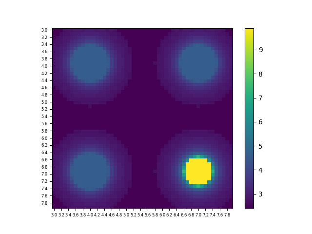
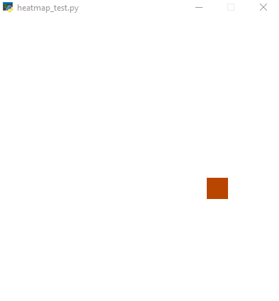

# 2DGrid-Agent
This repo contains a code demonstrating the DQN agent searching for an optimum on the 2D grid.  

The code is written using Python `keras (tf backend)`, `keras-rl`, and `gym`. It is comfortable to run the code on the CPU, training times are about 2-5 minutes.

## Environment
Environment is 20x20 grid that has the specific value of the target function in each cell. The target function has three local and one global maximums:  
  

## /finite case
This is the case where the agent is rewarded once per episode at the moment it reaches the optimum.  
The agent learns to stabely reach the optimum in ~13k iterations.  



Reward:
* step penalty
* edge-touching penalty
* reward for optimum
* path non-consistency penalty

Learning:
* feeding in last 3 steps coordinates
* feeding in last 3 steps target function values
* 96-64-64-32 relu fully connected
* BoltzmannGumbelQPolicy

## /infinite case
This is the case the target function shifts through time, and the agent is rewarded each step based on the target function value. The episode lasts till reaching max_steps and the agent has an action of standing still.  
The agent learns to stabely reach the optimum in ~50k iterations.  


(difference with the first setup is marked with bold)  
Reward:
* step penalty
* **idle penalty**
* edge-touching penalty
* reward for **being in an optimum**
* path non-consistency penalty

Learning:
* feeding in last 3 steps coordinates
* feeding in last 3 steps target function values
* **feeding in time phase**
* 96-64-64-32 relu fully connected
* BoltzmannGumbelQPolicy

## Running
```text
pip install tensorflow
pip install keras
pip install gym
pip install keras-rl
```

To run the script simply execute:
```text
cd /finite
python run.py
```